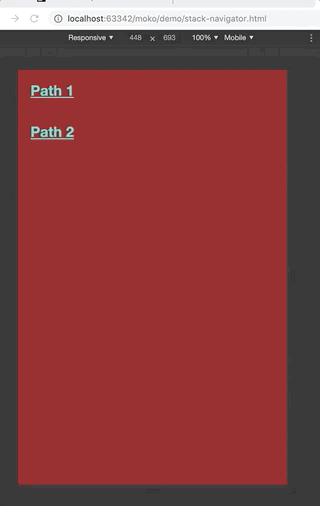
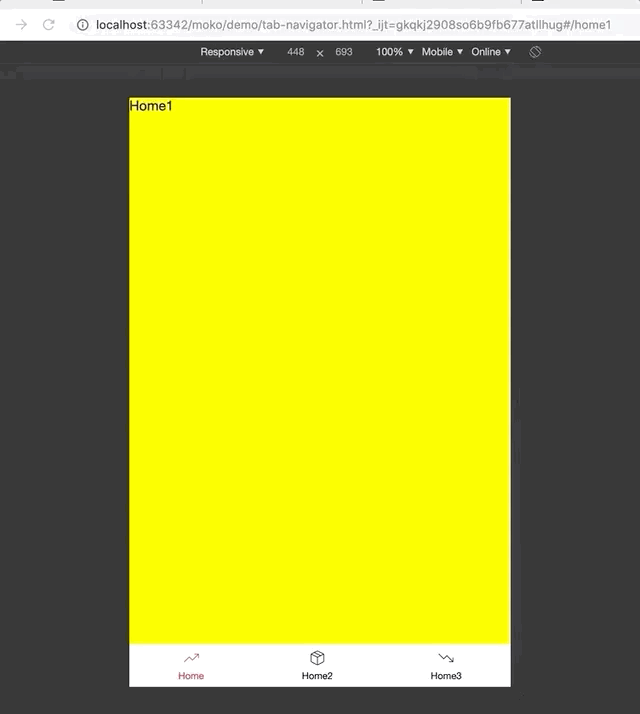

# Moko

Moko is a lightweight WebComponents based navigation library
highly inspired by [React Navigation](https://reactnavigation.org).

It supports three kinds of navigators:

- switch navigator
- stack navigator
- tab navigator

## Switch navigator

Switch navigator only show one content at a time, each route displaying a different content. Content is not cached


Code example:

```html
<moko-switch-navigator>
  <moko-route path="view1/:name" component="demo-view1">
    <span>diego</span>
  </moko-route>
  <moko-route path="view2/:name" component="demo-view2"></moko-route>
  <moko-route path="view3/:name" component="demo-view3"></moko-route>
</moko-switch-navigator>
```

A navigator contains multiple `<moko-route>`. A route has two mandatory attributes `path` and `component`.

- `path` associates the route to an url fragment. Each time an url match that path, the content associated with that route will be displayed. The path can contain placeholders
- `component` name of the Web Component that will be displayed when an url match the route's path.

Navigation is triggered either with standard `<a href="#some-route">Click</a>` or with safer moko provided custom element
`<moko-link to="some-route""></moko-link>`. `moko-link` supports navigator nesting.

If the url fragment is empty, the first route will be rendered.

By default a navigator will take all space available in his node ancestor.

### Server side rendering

First `moko-route` element can contain markup that will be displayed before corresponding web component is rendered properly.
It allows to server side render content and make the page SSO friendly.

### Demo

See [switchNavigator.html](./demo/switchNavigator.html) for a complete example.

## Stack navigator

Stack navigator will display new content on top of previous one while navigating.



Code example:

```html
<moko-stack-navigator>
  <moko-route path="path1" component="demo-el1"></moko-route>
  <moko-route path="path2" component="demo-el2"></moko-route>
  <moko-route path="path3" component="demo-el3"></moko-route>
</moko-stack-navigator>
```

### Demo

See [stackNavigator.html](./demo/stack-navigator.html) for a complete example.

### Server side rendering

First `moko-route` element can contain markup that will be displayed before corresponding web component is rendered properly.
It allows to server side render content and make the page SSO friendly.

## Tab navigator

Tab navigator will display a tabbar at the bottom of the screen. Each click on a tab entry will
display different content.



Code example:

```html
<moko-tab-navigator active-color="red">
  <moko-tab-route
    icon="trending-up"
    title="Home"
    path="home1"
    component="demo-home"
  >
  </moko-tab-route>
  <moko-tab-route
    icon="package"
    title="Home2"
    path="home2"
    component="demo-home2"
  >
  </moko-tab-route>
  <moko-tab-route
    icon="trending-down"
    title="Home3"
    path="home3"
    component="demo-home3"
  >
  </moko-tab-route>
  <div style="height: 200%; background: yellow">Home1</div>
</moko-tab-navigator>
```

### Demo

See [tabNavigator.html](./demo/tab-navigator.html) for a complete example.

### Server side rendering

`moko-tab-navigator` element can contain markup as last child that will be displayed before corresponding web component is rendered properly.
It allows to server side render content and make the page SSO friendly.

### Using navigators in your webpage

Each navigator is available as Web Components through ES6 modules (see the [dist](https://github.com/dsolimando/moko/tree/master/dist) folder).

## Live Demos

* [Switch Navigator](http://plnkr.co/edit/3EWAOLDUtFfWOaupwtdZ?p=preview)
* [Stack Navigator](http://plnkr.co/edit/7CJPynCaB8wyWmMa3EKw?p=preview)
* [Tab  Navigator](http://plnkr.co/edit/vC5DSIE2aKzkRlayJTmF?p=preview)
